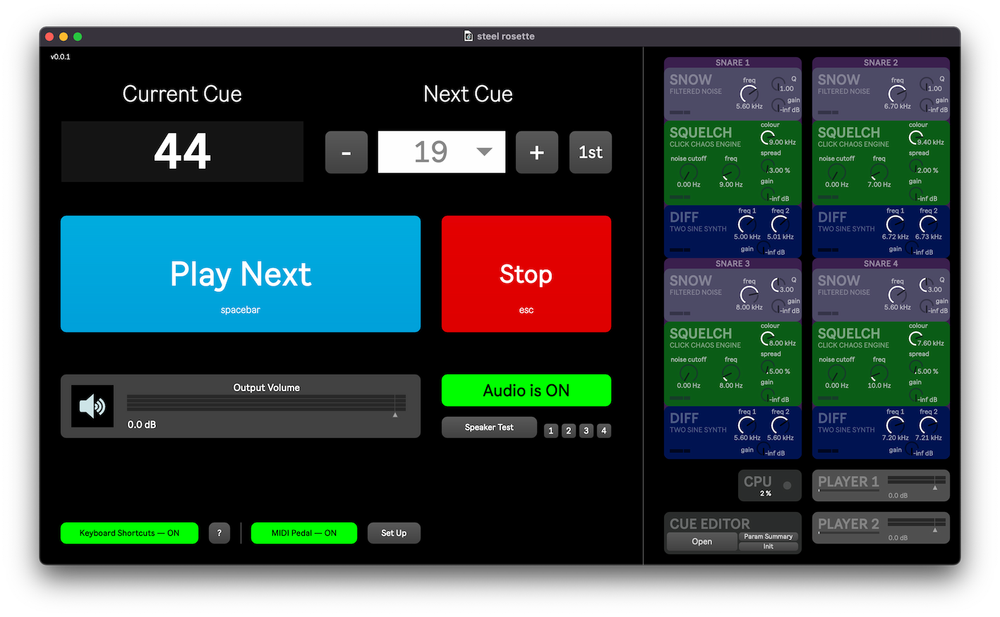

# steel rosette

🎻 electronics for Chris Swithinbank’s _steel rosette_, for small ensemble.

## Installation

`steel-rosette` is a package for use with Cycling 74’s [Max](https://cycling74.com/products/max/) software. If you don’t own Max, you can [download it from Cycling 74’s website](https://cycling74.com/downloads/) for free. This package requires Max 8. Earlier versions of Max are not supported.

To install the `steel-rosette` package:

1. Move the folder containing this README file to your packages directory:
   `~/Documents/Max 8/Packages`

2. Restart or open Max.

## Performance Set-up

A performance of _steel rosette_ requires the following technical set-up:

- a computer running this `steel-rosette` package
- a MIDI pedal and USB interface for cue triggering (e.g. [TEC’s controller](https://www.tecontrol.se/products/usb-midi-pedal-controller))
- audio interface with 4 output channels
- 4 lightweight transducer speakers (placed on 4 snare drums)

### Patch I/O

#### Inputs

n/a

#### Outputs

1. Snare drum 1
2. Snare drum 2
3. Snare drum 3
4. Snare drum 4

## Operating the patch

### Getting Started

1. Open **Max**.

2. From the **Extras** menu, select **steel rosette**. This window should appear:

3. If the audio is off, turn it on, using the large red button that reads **Audio is OFF**. It will turn green and read **Audio is ON**.

4. If you need to test your audio output, you can use the **Speaker Test** button to send out short bursts of white noise. To test just one channel at a time, you can use the numbered buttons to test output channels **1**, **2**, **3** and **4** separately.

### Performing with the patch

The patch window indicates the **Current Cue** at the top left, and the **Next Cue** that will be played at the top right.

Cue 1 initialises the patch, opening inputs into the reverb engine. All subsequent cues are numbered to match the bar numbers in which they occur.

During a performance, use the large blue **Play Next** button or the <kbd>spacebar</kbd> to trigger the next cue at the appropriate moment. (Or use a MIDI pedal, see below.)

By default, keyboard shortcuts are enabled and you can use the following shortcuts to control the patch:

|      shortcut       |                                  |
| :-----------------: | :------------------------------- |
| <kbd>spacebar</kbd> | _play next cue_                  |
|  <kbd>escape</kbd>  | _stop playing_                   |
|    <kbd>1</kbd>     | _set next cue to be first cue_   |
|    <kbd>▶</kbd>     | _increment next cue number_      |
|    <kbd>◀</kbd>     | _decrement next cue number_      |
|    <kbd>▲</kbd>     | _increase output volume by 1 dB_ |
|    <kbd>▼</kbd>     | _decrease output volume by 1 dB_ |

### Rehearsal Tips

- To stop playback at any point during rehearsal, click the red **Stop** button, or hit the <kbd>escape</kbd> key.

- Use the <kbd>◀</kbd> and <kbd>▶</kbd> arrow keys to set up the next cue, or use the <kbd>1</kbd> key to reset the next cue to the beginning. To select a specific cue, you can click on the **Next Cue** number and a menu will appear from which you can choose the cue you need.

### Using a MIDI pedal

If you prefer not to use the keyboard to trigger cues during a performance,
you can use a MIDI pedal instead. Pressing the pedal will trigger the next event
and is equivalent to using the <kbd>spacebar</kbd> or pressing the **Play Next**
button.

#### Configuring your pedal

1. Click on **Set Up** to open the MIDI pedal configuration window.

2. Select the correct MIDI device for your pedal.

3. Select whether the next event should be triggered on `127` or `0`.

In the lower half of the **Set Up** window, you will be able to see the pedal
input as it comes in to help while configuring your MIDI pedal.
